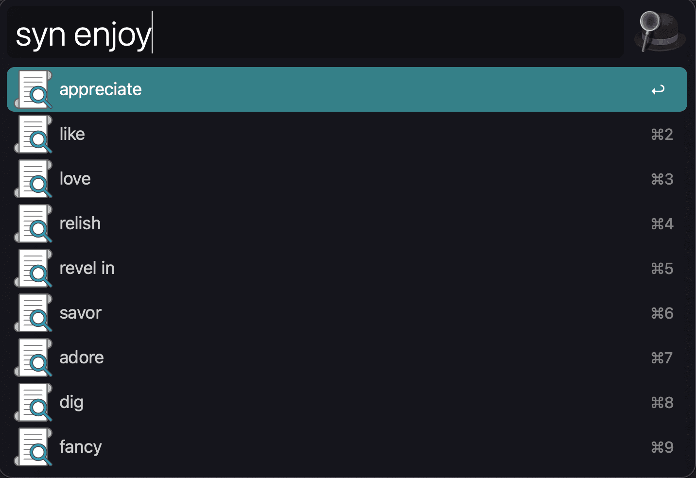
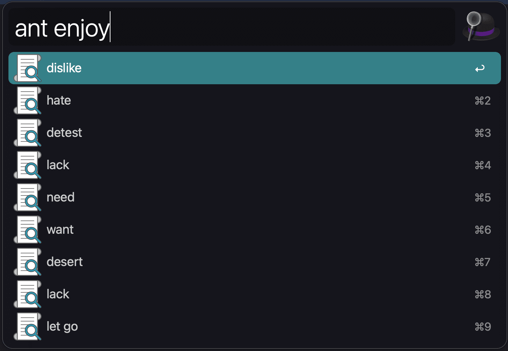

# alfred-thesaurus
Alfred workflow for finding synonyms and antonyms of words written in Rust

<p align="center"><a href="https://github.com/omerdn1/alfred-thesaurus/releases/"></a></p>
<p align="center"><a href="https://github.com/omerdn1/alfred-thesaurus/releases/"></a></p>

## Commands

* `syn {word}`: lookup synonyms for a given word
* `ant {word}`: lookup antonyms for a given word

## [Download .alfredworkflow](https://github.com/omerdn1/alfred-thesaurus/releases/) 

### Rebuild binary and alfred workflow

```
./build-workflow.sh
open alfred-thesaurus.alfredworkflow
```
